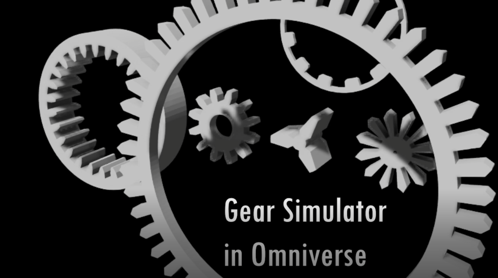
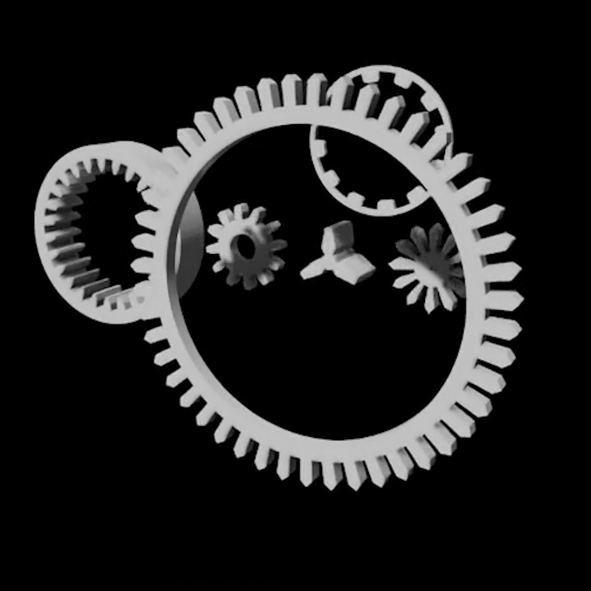
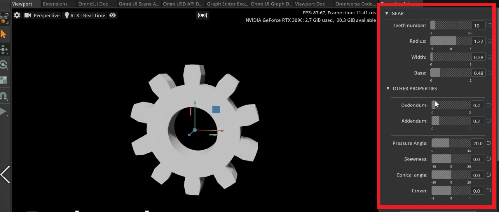
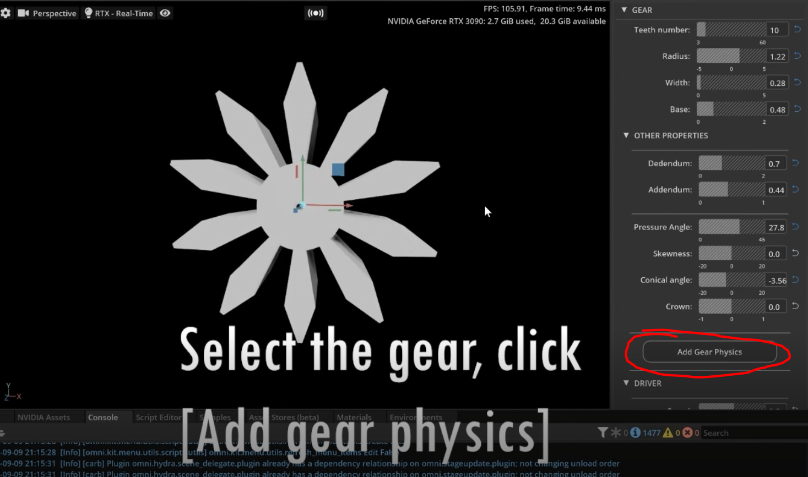
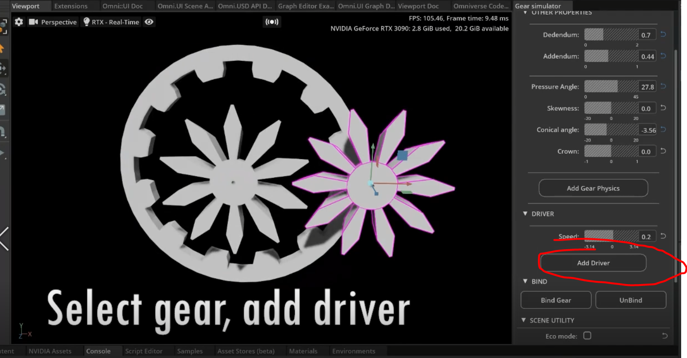
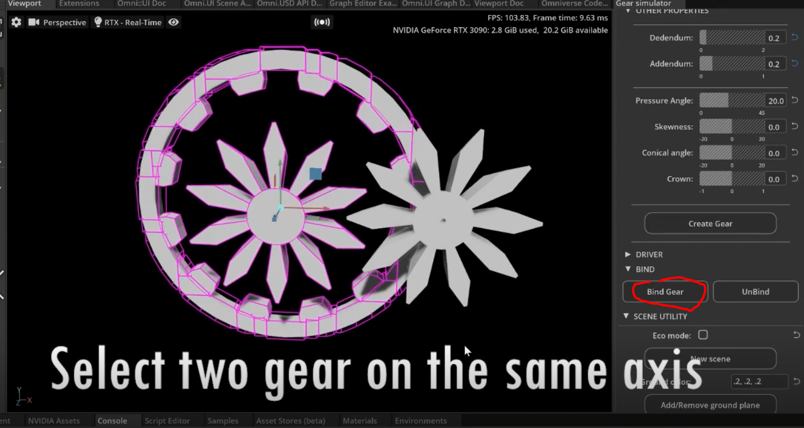

# GearSimulator



This extension allows to simulate gears with exact physics in Omniverse.

This repository is inspired by [blender](https://www.blender.org/).

<div>
    
    
</div>


Gear analysis is fun but hard. Without getting connect to good physics, the gear simulation cannot be performed accurately. We provide this extension `Gear Simulator` in Omniverse to support customized gear with customized analysis.

# Get started with Omniverse Code/Create [version >= 2022]

## Download the [release](https://github.com/yizhouzhao/GearSimulator/releases/tag/0.2) or clone the this repository 

```
git clone https://github.com/yizhouzhao/GearSimulator
```

Upzip or locate the root folder as <your-path-to-GearSimulator>

The file structure of this extension should look like:

```
<your-path-to-GearSimulator>
    └───exts    [Omniverse extenstion]
         └───your.app.template
                └───config  [Extension config]
                └───icons   [Extension icons]
                └───gear/simulator   [source code]
    └───img   
    │   .gitignore 
    │   README.md  
    └───sample [sample scenes]   
    ......
```

## Add extension to Omniverse

1. **[Open extension manager]** After opening Omniverse Code, go to `Menu` -> `Window` -> `Extension`

2. **[Add this extension to Omniverse]** Click the   button, add absolute extension path to `Extension Search Paths`.

Finally, you can search the `your.app.template` and enable this extension.

> **Note**:
> The extension path to add is: `<your-path-to-GearSimulator>/exts`


# Play with Gear Simulator

## 1. Create Gear

Set up gear properties and Click `Create Gear`


We support live editting gear features.



## 2. Add physics

Right now, the gear is just a mesh with any collision or rigid body. 

Click `Add Physics` to add rigid body, and D6 joint to the gear. The D6 joint allows it to rotate on z-axis.



## 3. Add Driver

To make the gear rotate by itself, we can click `Add Driver` with a specific speed.




# Additional features

## Bind two gear

Two simulate two gears rotate on the same axis, select two gears and 

click `Bind Gear` to add a fixed joint between them.

