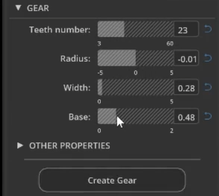
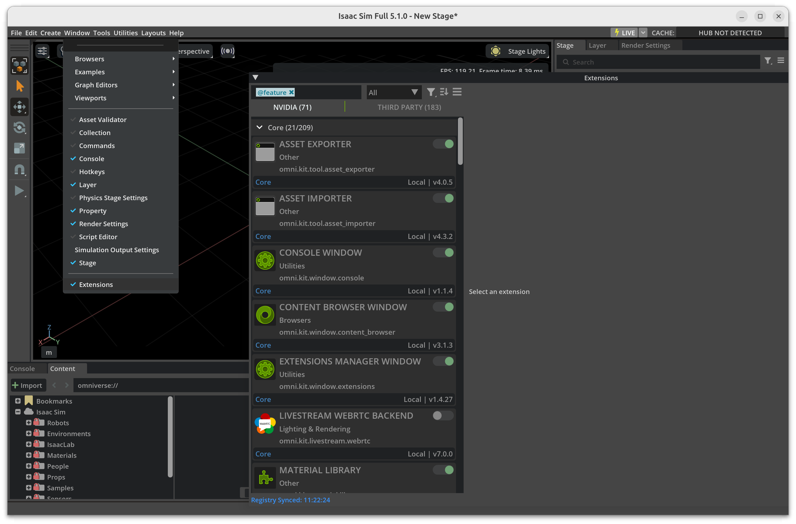
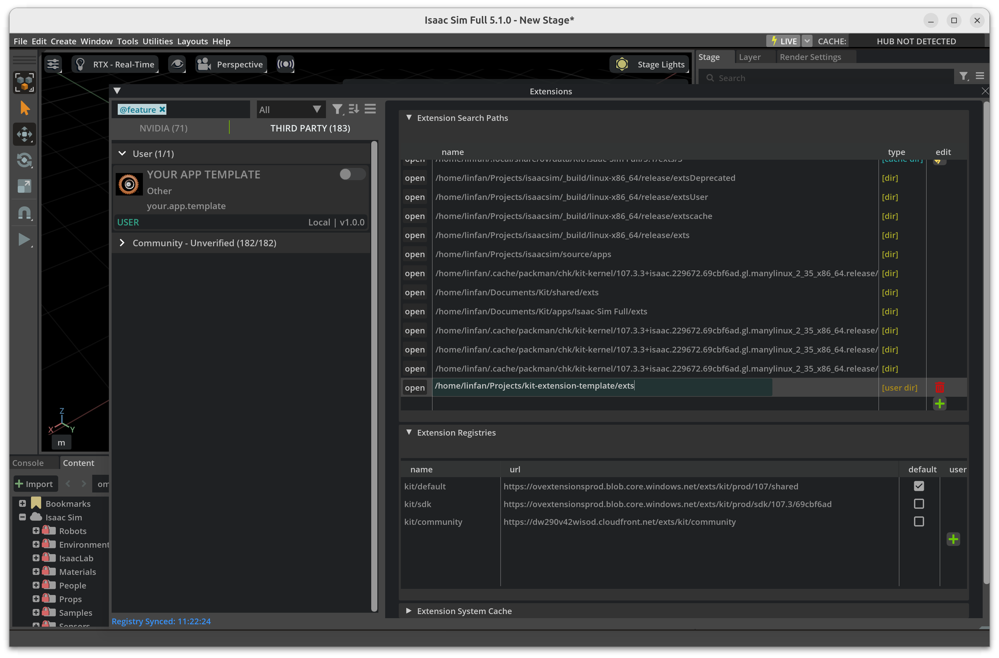
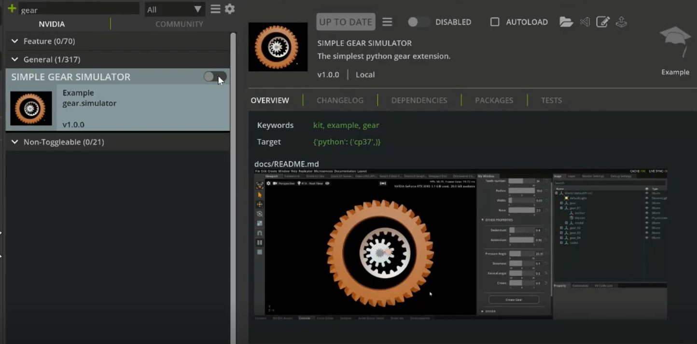

# Kit Extension Template

A Kit Extension Template for Omniverse Kit/Isaac Sim.

As the official [Isaac Sim Extension Generator](https://docs.isaacsim.omniverse.nvidia.com/6.0.0/utilities/extension_template_generator.html) is too complicated, I am creating this repo for simplicity.

Extension window Screenshot:



## Download the [release](https://github.com/yizhouzhao/GearSimulator/releases/tag/0.2) or clone the this repository 

```
git clone https://github.com/yizhouzhao/kit-extension-template
```

Upzip or locate the root folder as <your-path-to-GearSimulator>

The file structure of this extension should look like:

```
<your-path-to-this-extension>
    └───exts    [Omniverse extenstion]
         └───your.app.template
                └───config  [Extension config]
                └───icons   [Extension icons]
                └───your/... [source code]
    └───img   
    │   .gitignore 
    │   README.md  
    ......
```

## Add extension to Omniverse

1. **[Open extension manager]** After opening Omniverse Code, go to `Menu` -> `Window` -> `Extension`




2. **[Add this extension to Omniverse]** Click the   button, add absolute extension path to `Extension Search Paths`.



Finally, you can search the `your.app.template` (locate in the `Third Party tag`) and enable this extension.

> **Note**:
> The extension path to add is: `<your-path-to-this-repo>/exts`



